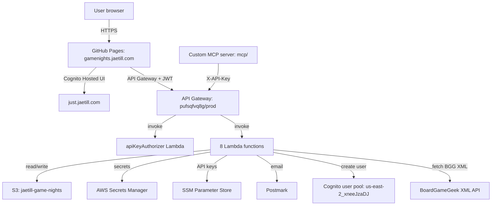

# Architecture overview

## Context

`game-night-pwa` is a PWA for organizing board game nights with a small friend group. Features: event creation, RSVP tracking, board game collection management (via BoardGameGeek), email invitations and nudges, and host controls. Hosted at `https://gamenights.jaetill.com` (GitHub Pages frontend, AWS backend).

## Container view (C4 level 2)

## Components

- **GitHub Pages frontend:** Vite-built SPA, vanilla JS + Tailwind. No CloudFront. CNAME `gamenights.jaetill.com` → `jaetill.github.io`. Entry points: `index.html`, `callback.html`, `login.html`, `signup.html`.
- **Cognito Hosted UI:** at `just.jaetill.com`, shared with `meal-planner` and `jaetill-portal`. This project's user pool client is `34et7dk67ngqep1oqef49te0ic` (`GameNightPlannerWeb`). Required group claim: `game-night-users`.
- **API Gateway** (`pufsqfvq8g`, `prod` stage): single dual-mode authorizer (`apiKeyAuthorizer` Lambda) accepts X-API-Key OR Cognito JWT.
- **Lambda functions** (8): `apiKeyAuthorizer`, `nudgeNonResponders`, `bggProxy`, `GeneratePresignedGetUrl`, `GeneratePresignedPost`, `createEvent`, `searchGames`, `groups`. All Node.js CommonJS.
- **S3 bucket** (`jaetill-game-nights`, private): holds `gameNights.json`, `profiles/{userId}.json`, `collections/{userId}.json`. Frontend never reads/writes S3 directly — always via presigned URLs from Lambda.
- **Secrets Manager** (`shared/postmark-api-key`): Postmark server token. Module-scoped cached at first Lambda access.
- **SSM Parameter Store** (`/game-night/api-keys/{key}`): stores Cognito username for X-API-Key auth.
- **MCP server** (`mcp/`): custom MCP server using `@modelcontextprotocol/sdk` (stdio). Tools: `search_games`, `list_groups`/`save_group`, `create_event`, `invite_to_event`, `list_events`/`get_event`. Auth via `GAME_NIGHT_API_KEY` env var.

## Key design decisions

ADRs in [`docs/adr/`](../adr/index.md). The first ADR is platform adoption ([ADR-0001](../adr/0001-platform-adoption.md)).

Key existing decisions inherited from `CLAUDE.md`:
- Frontend on GitHub Pages, not CloudFront. All S3 access via presigned URLs from Lambda.
- Single API Gateway with one dual-mode authorizer (X-API-Key OR JWT). `apiKeyAuthorizer` pins JWT to this project's App Client AND requires `game-night-users` group claim — meal-planner tokens won't pass.
- Cognito user pool shared across three projects but each uses its own App Client.
- Postmark over SES because it predated SES setup and works fine.
- Cognito provisioning suppresses the default Cognito welcome email; Postmark sends a single "You're invited" email with credentials inline (per Cognito's choice-based-auth requirement of a temporary password).
- Username can't be email-format (Cognito alias config); new users get UUID usernames; the email is shown in the credentials block so the invitee knows what to type at the Hosted UI's non-customizable "Username" prompt.

## Existing audits

- [`docs/iam-audit.md`](../iam-audit.md) — IAM role audit (2026-04-12) covering the 8 Lambda execution roles.

## Non-functional targets (SLOs per platform ADR-0009 §8)

- Availability: 99.5% (≈3.6h downtime/month)
- p99 latency: <500ms on primary endpoints
- Error rate: <0.5%

These are aspirational pending Phase 5 of the integration plan (observability) — currently no Sentry, so error rate is unmeasurable beyond CloudWatch Logs.

## Out of scope

- Multi-tenant. The user base is "Jason's friend group."
- Public discovery / SEO. The app is invite-only.
- Mobile native. PWA install is supported but no React Native / Swift / Kotlin app.
